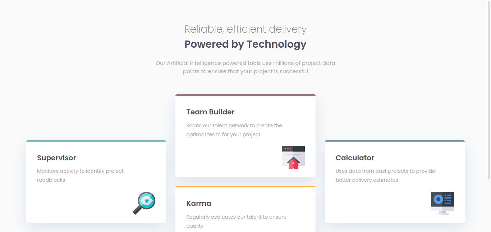

# Frontend Mentor - Four card feature section solution

## Table of contents

- [Overview](#overview)
  - [The challenge](#the-challenge)
  - [Screenshot](#screenshot)
- [My process](#my-process)
  - [Built with](#built-with)
  - [What I learned](#what-i-learned)
  - [Continued development](#continued-development)

## Overview

### The challenge

This challenge was easy, I had not a problem with this challenge.

### Screenshot

## My process

I start to make the file HTML and after that with the CSS, I use flexbox and especially grid. I did 3 media queries, I could do more but I don't see it necessary.

### Built with

- Semantic HTML5 markup
- CSS custom properties
- Flexbox
- CSS Grid

### What I learned

I don't learned nothing in this challenge but this challenge get it to me because I can practice my knowledge about CSS and HTML

### Continued development

I will continue development my skills about flexbox and grid